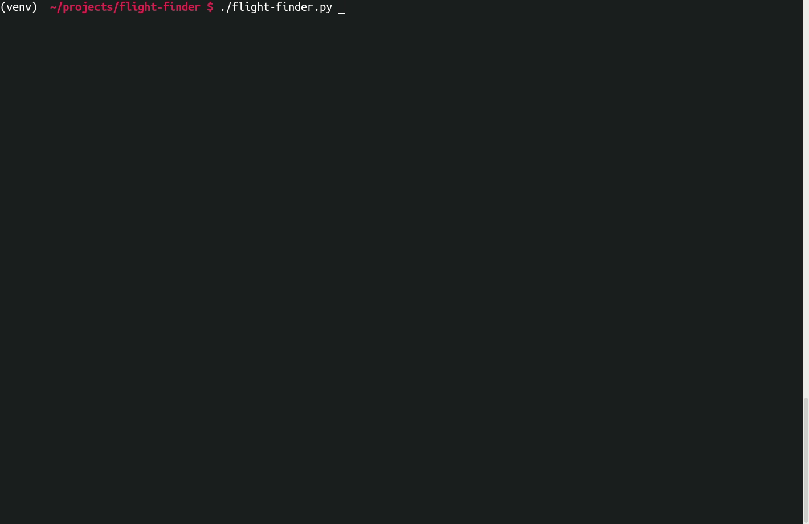

## Simple cli flight search script

#### Using Kiwi.com API

##### *** Python 3.5.3+ required

##### Navigate to the project directory and create virtual environment 

```sh
python -m venv venv
```

##### Activate it

```sh
source venv/bin/activate
```

##### Install dependencies

```sh
pip install -r requirements.txt
```

##### Options are:

--origin, -o : The city of departure.  
--destination, -d : The destination city.  
--date_from, -f : Start of departure date range. default TODAY.  
--date_to, -t : End of departure date range. default TOMORROW.  
--return_from : Start of arrival date range.  
--return_to : End of arrival date range.  
--direct : Search for direct flights only. default False.  
--max_price, -m : Maximum price of ticket.  
--limit, -l : Max number of search results. default 10.  

##### Run the script

```sh
./flight-finder.py
```

##### Or run it with arguments

```sh
./flight-finder.py --origin Bishkek --destination Los-Angeles
```


